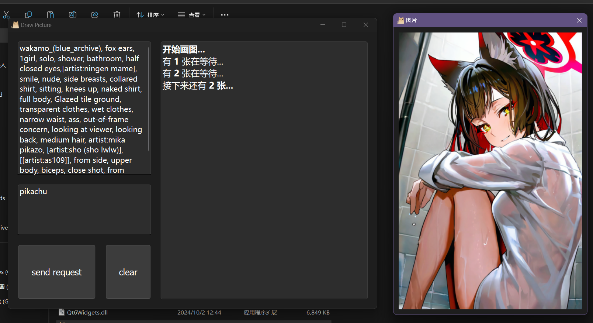

# qt-pic

## 介绍

用远程绘图 api 进行画图的小软件。初衷是熟悉熟悉qt和cpp。

需要在软件目录下新建 ApiData.json 文件，内容应当是url、header和body。例如，本地的stable diffusion api，ApiData.json 应该这么写：

```json
{
	"url": "https://localhost:7860/api/v3/txt2img",
	"header": {
		"api": "1",
		"api_key": "xxxxxx"
	},
	"body": {
		"key": "",
		"prompt": "ultra realistic close up portrait ((beautiful pale cyberpunk female with heavy black eyeliner))",
		"negative_prompt": null,
		"width": "512",
		"height": "512",
		"samples": "1",
		"num_inference_steps": "20",
		"safety_checker": "no",
		"enhance_prompt": "yes",
		"seed": null,
		"guidance_scale": 7.5,
		"multi_lingual": "no",
		"panorama": "no",
		"self_attention": "no",
		"upscale": "no",
		"embeddings_model": null,
		"webhook": null,
		"track_id": null
	}
}
```

之后会添加不同api适配，目前只有一套。（而且这套api并不规范）

## 功能

- 图片预览
- 图片和参数保存
- “上一次输入的prompt”


